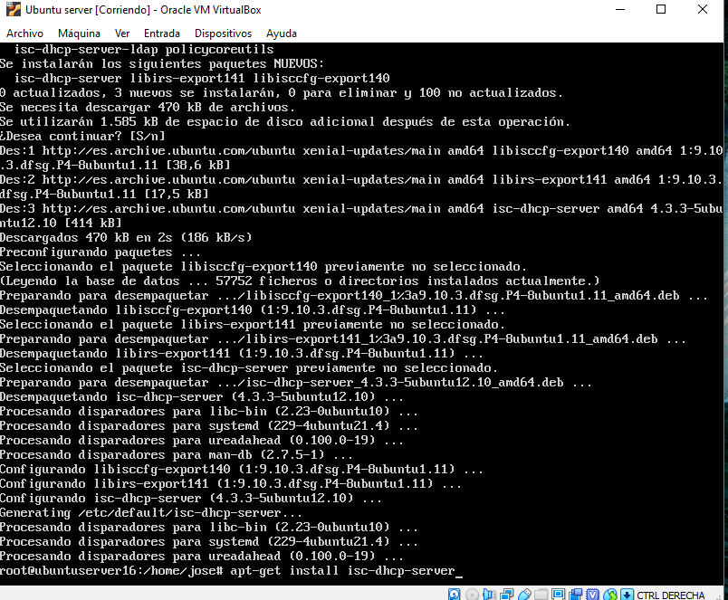
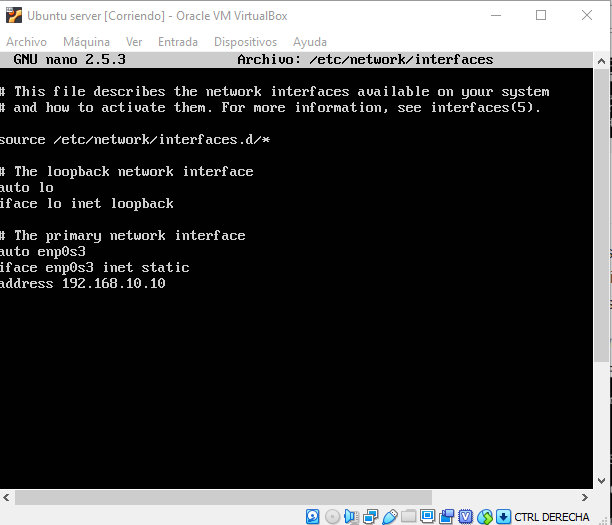
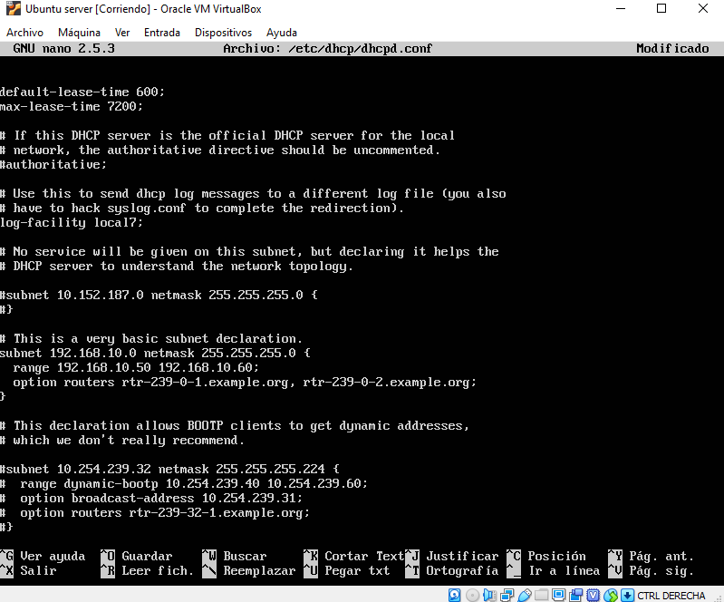
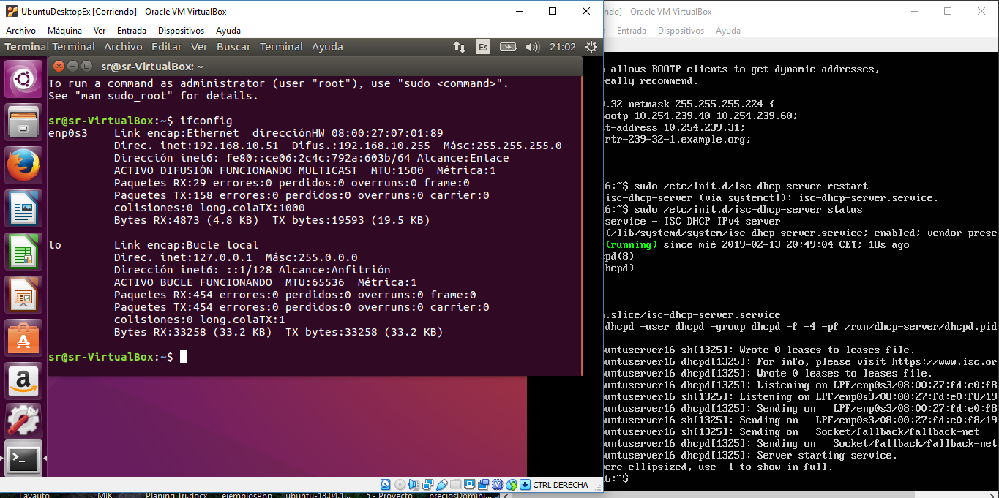

# Configuración de un servidor DHCP en Ubuntu Server 16.04.1

## Introducción
El protocolo de configuración dinámica de host, ***DHCP*** (Dynamic Host Configuration Protocol),
es un protocolo de red de tipo cliente/servidor mediante el cual un servdidor DHCP asigna
dinámicamente una dirección IP a cada dispositivo en una red para que puedan comunicarse
con otras redes.
[Ver más información.](https://es.wikipedia.org/wiki/Protocolo_de_configuraci%C3%B3n_din%C3%A1mica_de_host)

## Instalación del servicio
Lo primero que se debe hacer es abrir un terminal para poder trabajar como administradores.
Para ello con el comando ***`sudo su`*** obtendremos credenciales de superadmisnitrador.

Ya como afdministradores haremos una actualización del sistema como medida de precaución. Para
ello utilizaremos los comandos ***`apt-get update`*** y ***`apt-get upgrade`***

Hecho esto, procederemos a instalar el servidor dhcp ***`apt-get install isc-dhcp-server`***

## Configuración IP estática del servidor
El propio servidor no puede darse una dirección IP a si mismo por lo que 
hay que configurar una IP estática en nuestro servidor. 

Utilizando el comando ***`nano /etc/network/interfaces`***, editamos un fichero de configuración
y así le asignamos una dirección IP de forma manual y tendremos que escribir en la interfaz que queremos este fragmento de texto:

    iface [nombre de la interfaz (enp0s3)] inet static
    address [@IP de la interfaz]
    network [rango de @IP]
    broadcast [@broadcast]
    netmask [mascara]
    
Hay que seleccionar la tarjeta de red que vamos a utilizar para repartir direcciones:
***`nano /etc/default/isc-dhcp-server`***

Añadimos: interface="enp0s3" y también en el apartado ***`auto enp0s3`*** del siguiente fichero, por lo que la línea de comandos
quedaría de la siguiente manera:

## Configuración DHCP
Como administradores de sistemas se debe hacer una copia de seguridad antes de hacer cualquier tipo de cambio
en un ***.conf*** por lo que se usaremos el siguiente comando ***`Cp /etc/dhcp/dhcpd.conf /etc/dhcp/copy-dhcp.conf`***.

Hecho esto se puede verificar que se haya hecho correctamente la copia de seguridad con el comando 
***`ls de la carpeta /etc/dhcp `***.

Una vez hecha la copia de seguridad lo que tendremos que hacer es editar dicho fichero, para poder asignar el rango de 
IP que queremos que dé, junto a algún dato más como por ejemplo el nombre del dominio. Para ello usaremos el 
comando ***`nano /etc/dhcp/dhcpd.conf`***, y configuramos la subnet, por ejemplo:

Realizados estos pasos, nuestro servidor ya estaría instalado. Y para ponerlo en funcionamiento solo 
tendríamos que usar un sencillo comando:

    /etc/init.d/isc-dhcp-server start	   Inicia el servidor
    /etc/init.d/isc-dhcp-server stop	   Detiene el servidor
    /etc/init.d/isc-dhcp-server restart	   Reinicia el servidor

## Cliente Ubuntu
Por útlimo, comprobamos con ***`ifconfig`*** que tengamos la IP deseada:

